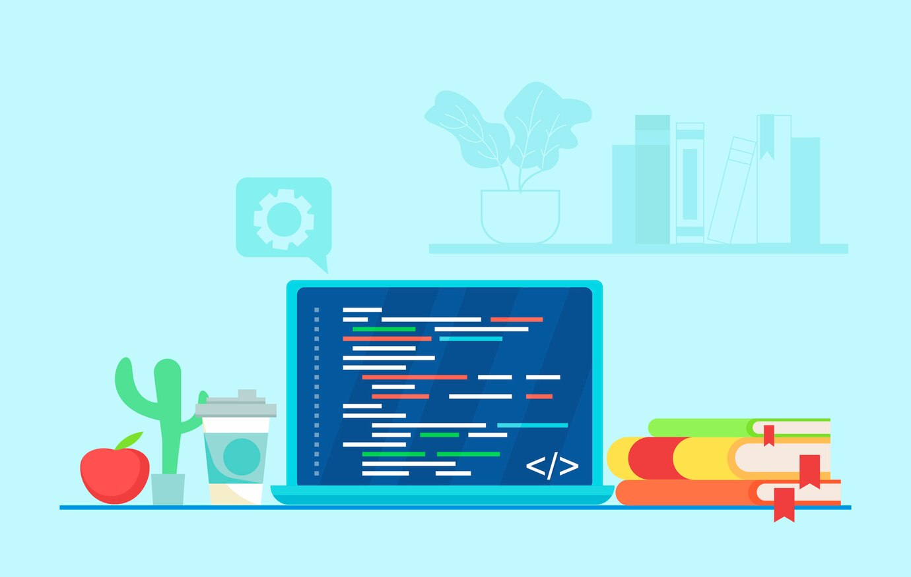
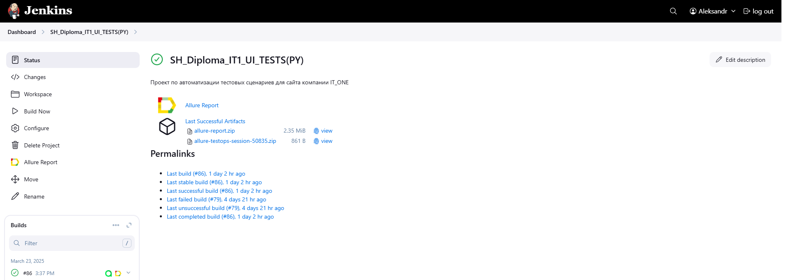

# Проект по автоматизации тестовых сценариев для сайта компании T1
##  Содержание:

- <a href="#stech">Используемый стек технологий и инструментов</a>
- <a href="#check">Реализованные проверки</a>
- <a href="#engine">Запуск автотестов</a>
- <a href="#build">Сборка в Jenkins</a>
- <a href="#report">Интеграция с Allure</a>
- <a href="#testops">Интеграция с Allure TestOps</a>
- <a href="#jira">Интеграция с Jira</a>
- <a href="#telegram">Уведомления в Telegram через бота</a>
- <a href="#video">Видео отчет запуска тестов (Selenoid)</a>

<a id="stech"></a>
##  Используемый стек технологий и инструментов

| Python                                                    | Pycharm                                                    | GitHub                                                    | Pytest                                                    | Selenide                                                    | Selen                                                      | Allure<br/>Report                                                | Allure <br> TestOps                                               | Jenkins                                                    | Jira                                                    |                                                    Telegram |
|:----------------------------------------------------------|------------------------------------------------------------|-----------------------------------------------------------|-----------------------------------------------------------|-------------------------------------------------------------|------------------------------------------------------------|------------------------------------------------------------------|-------------------------------------------------------------------|------------------------------------------------------------|---------------------------------------------------------|------------------------------------------------------------:|
|  |  |  |  |  |   |  |  |  |  |  |


<a id="chek"></a> 
##   Реализованные проверки
- Проверка открытия нужного сайта
- Проверка контента хедера
- Проверка поиска
- Проверка обратной связи
- Проверка информации о холдинге
- Проверка информации о пресс-центре

<a id="engine"></a> 
##  Запуск автотестов


### Запуск тестов из терминала удаленно (Selenoid): 
```
SELENOID_LOGIN=user1
SELENOID_PASS=1234
SELENOID_URL=selenoid.autotests.cloud      
```
### Запуск тестов c задаными параметрами в Jenkins:   
```   
python -m venv .venv
source .venv/bin/activate
pip install -r requirements.txt
pytest .
```
<a id="build"></a> 
##  Сборка в Jenkins

Для запуска сборки необходимо перейти в раздел **"Build with Parameters"** и нажать кнопку **"Build"**.
<p align="center">
 
</p>

После выполнения сборки, в блоке **Build History** напротив номера сборки появятся значки 
и  , при клике на которые откроются соответствующие
артефакты.  

##  Интеграция с Allure

<a id="report"></a> 
### Allure отчет

<p align="center">   
    
</p>

### Подробнее   
<p align="center">     
    
</p>       

##  Интеграция с Allure TestOps
          

<a id="testops"></a>
### Allure TestOps отчет

#### Overview

<p align="center">    

</p>

#### DashBoards
<p align="center">

</p>


#### Подробнее

<p align="center">

</p>


<a id="jira"></a> 
##  Интеграция с Jira


<p align="center">

</p>

##  Уведомления в Telegram через бота


<a id="telegram"></a> 
<p align="center">

</p>


<a id="video"></a> 
##  Видео отчет запуска тестов (Selenoid)

<p align="center">
  
</p>